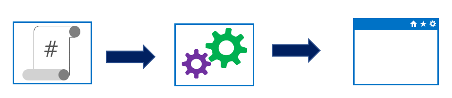

# workshop-get-started-with-bicep

Workshop Repository for Getting Started with Bicep for Infrastructure as Code

## About Bicep

Azure Bicep is the next revision of ARM templates designed to solve some of the issues developers were facing when deploying their resources to Azure.

It's an Open Source tool and, in fact, a domain-specific language (DSL) that provides a means to declaratively codify infrastructure, which describes the topology of cloud resources such as VMs, Web Apps, and networking interfaces. It also encourages code reuse and modularity in designing the infrastructure as code files.

## Why Infrastructure as Code

An important part of Azure and Cloud Governance in any Organization is to encourage and use Infrastructure as Code (IaC) for deployments, and to be part of the requirement for Continuous Integration (CI) / Continuous Deployment (CD) either via Azure DevOps pipelines or Github Actions.

### Implementing infrastructure as code

With infrastructure as code, you capture your environment (or environments) in a text file (script or definition).

Your file might include any networks, servers, and other compute resources.

You can check the script or definition file into version control and then use it as the source for updating existing environments or creating new ones.

For example, you can add a new server by editing the text file and running the release pipeline rather than remoting it into the environment and manually provisioning a new server.

The following table lists the significant differences between manual deployment and infrastructure as code.

| Manual deployment | Infrastructure as code |
|---|---|
| Snowflake servers. | A consistent server between environments. |
| Deployment steps vary by environment. |Environments are created or scaled easily. |
| More verification steps and more elaborate manual processes. | Fully automated creation of environment Updates. |
| Increased documentation to account for differences. | Transition to immutable infrastructure. |
Deployment on weekends to allow time to recover from errors. | Use blue/green deployments.
| Slower release cadence to minimize pain and long weekends. | Treat servers as cattle, not pets.

### Benefits of infrastructure as code

The following list is benefits of infrastructure as code:

* Promotes auditing by making it easier to trace what was deployed, when, and how. (In other words, it improves traceability.)
* Provides consistent environments from release to release.
* Greater consistency across development, test, and production environments.
* Automates scale-up and scale-out processes.
* Allows configurations to be version-controlled.
* Provides code review and unit-testing capabilities to help manage infrastructure changes.
* Uses immutable service processes, meaning if a change is needed to an environment, a new service is deployed, and the old one was taken down; it isn't updated.
* Allows blue/green deployments. This release methodology minimizes downtime, where two identical environments exist—one is live, and the other isn't. Updates are applied to the server that isn't live. When testing is verified and complete, it's swapped with the different live servers. It becomes the new live environment, and the previous live environment is no longer the live. This methodology is also referred to as A/B deployments.
* Treats infrastructure as a flexible resource that can be provisioned, de-provisioned, and reprovisioned as and when needed.

### Two main methods of IaC approach

* Declarative (functional). The declarative approach states what the final state should be. When run, the script or definition will initialize or configure the machine to have the finished state declared without defining how that final state should be achieved.
An arrow points from a script icon to an icon of two cogs representing coding procedures.

* Imperative (procedural). In the imperative approach, the script states the how for the final state of the machine by executing the steps to get to the finished state. It defines what the final state needs to be but also includes how to achieve that final state. It also can consist of coding concepts such as for, *if-then, loops, and matrices.

### Understand idempotent configuration

Idempotence is a mathematical term that can be used in Infrastructure as Code and Configuration as Code. It can apply one or more operations against a resource, resulting in the same outcome.

For example, running a script on a system should have the same outcome despite the number of times you execute the script. It shouldn't error out or do the same actions irrespective of the environment's starting state.

In essence, if you apply a deployment to a set of resources 1,000 times, you should end up with the same result after each application of the script or template.
